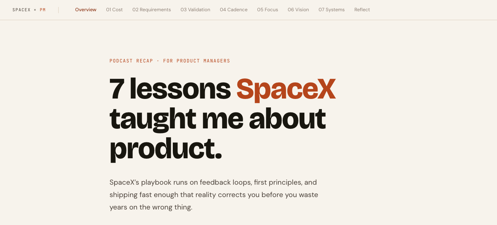
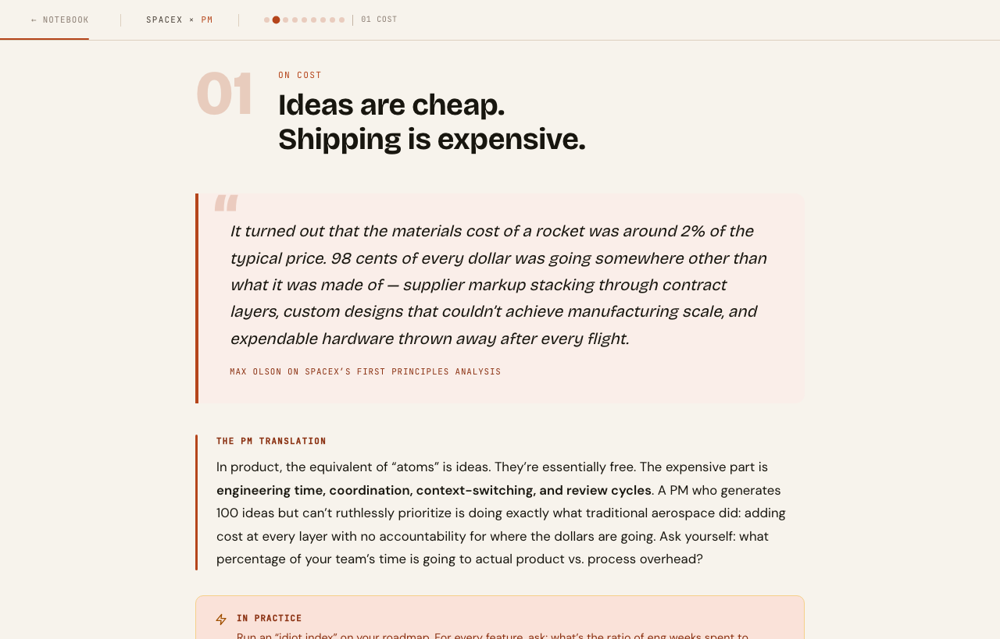
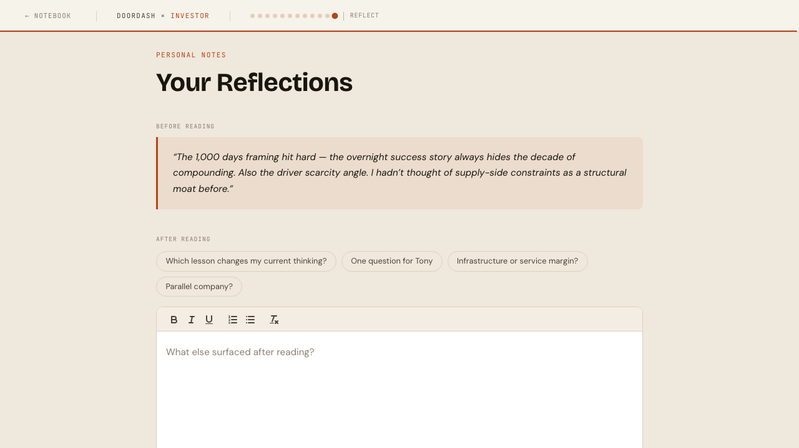
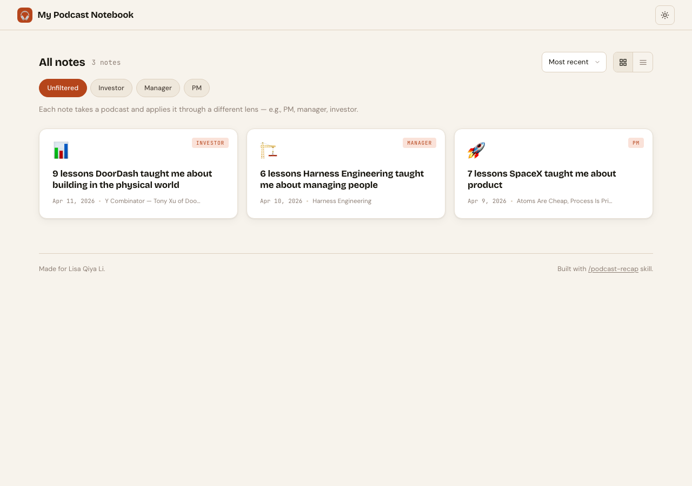

# podcast-recap

**Turn any podcast into a personalized knowledge note — built for how you actually learn, not how you wish you did.**

---

## The problem

You listen to a great podcast on your commute. Someone says something that makes you think "holy shit, I need to remember this." You feel genuinely smarter for 20 minutes.

Then you get to work. A Slack message comes in. You context-switch. By lunch, you can't remember a single specific thing from that podcast. You got excited, but you didn't actually learn anything.

This is the core tension of passive learning: the inspiration is real, but the retention is almost zero. Podcasts are consumed on the go, between things, in motion — which is exactly the wrong environment for turning ideas into lasting knowledge.

The standard fix is "just take notes." But who has time to sit down with a notebook while driving? Who actually goes back to re-read their notes from two weeks ago?

**podcast-recap solves this differently.**

---

## How it works

The workflow is designed around how your memory actually works, not around ideal behavior you'll never sustain.

**Step 1 — Listen normally.** No note-taking required. Just listen.

**Step 2 — Claude asks you two things first.** Before generating anything, Claude asks: *(1) What's your role or perspective for this recap?* and *(2) What's your immediate reaction from listening — what landed?* The podcast might not be in your industry — that's fine. The goal is to find the patterns and parallels that apply to *your* decisions. A story about DoorDash's logistics operations hits differently for a PM than for a founder or an investor. Claude makes this example specific to the actual episode. Your reaction anchors the analysis to your experience, not a generic reading. One sentence is enough for each. (If you're running the script directly without Claude, pass these as `--persona` and `--notes`.)

**Step 3 — Run podcast-recap.** The tool transcribes the full episode locally (no API key, runs on your machine), then generates a role-specific analysis connecting the podcast's big ideas to your actual work. Your reaction is woven in — so the output reflects what you actually got out of listening.

**Step 4 — Review the note.** You get a beautiful HTML document with pull quotes, your role-specific bridge between the podcast's ideas and your job, and a "try this" section for each theme. Your notes are woven in; the analysis references what you flagged.





At the end of each note, a reflections section captures what you brought into the reading and leaves space for what surfaced after:



**Step 5 — Browse your notebook.** Every note is automatically saved to `notebook/` and appears in your personal notebook at `https://[your-username].github.io/podcast-recap/notebook/`. Filter by persona, search by source, see everything you've captured in one place.



**Step 6 — Revisit on a schedule.** *(Coming soon: cron job integration.)* A spaced repetition system resurfaces past notes at the right intervals to move knowledge from short-term memory into long-term retention. The goal is to read it multiple times, not once, so it actually changes how you work.

---

## What makes this different from summarization

A summary assumes you didn't listen. You did.

podcast-recap assumes you already know what was said. What it does is draw connections between the podcast's first-principles thinking and **your specific role and context** — because a podcast about SpaceX's cost structure has completely different implications for a PM vs. a founder vs. a GTM lead.

The `--persona` flag works as a lens: "What does this mean for someone in my position, making the kinds of decisions I make, with the pressures I have?" That's what gets generated.

And the `--notes` flag is what makes it personal. When you pass your immediate reactions, the analysis anchors to *your* experience of the podcast, not a generic reading of it.

---

## Setup

### Dependencies

**Transcription — pick one:**

On Apple Silicon (M1/M2/M3/M4), use `mlx-whisper` for GPU-accelerated transcription (~7–10× faster than CPU):
```bash
pip3 install mlx-whisper
```

On any machine (Intel Mac, Linux, fallback):
```bash
pip3 install faster-whisper
```

The script tries `mlx-whisper` first and falls back to `faster-whisper` automatically — install whichever fits your machine.

**YouTube support (skip if you won't use YouTube URLs):**
```bash
brew install yt-dlp
```

No API keys. No cloud processing. Audio never leaves your machine.

The first run downloads a Whisper model (~250MB for the default `small` model). Subsequent runs use the cached model.

---

## Usage

### Don't have a URL? Just describe the episode

If you're using this inside Claude Code, you don't need to find the URL yourself. Just say:

> "Recap Lenny's podcast, the Amol Anthropic head of growth episode, for a PM"

Claude will search YouTube first, then fall back to the RSS feed if needed, find the URL, and run `transcribe.py` for you.

### How long does it take?

With `mlx-whisper` on Apple Silicon (recommended):

| Episode length | `small` model | `tiny` model |
|---|---|---|
| 30 min | ~1 min | ~30 sec |
| 1 hour | ~2 min | ~1 min |
| 2 hours | ~4 min | ~2 min |

On CPU (`faster-whisper` fallback), multiply by ~8–10×. The default model is `small` — accurate enough for technical content, fast enough on MLX to not think about it.

### What about Spotify?

Spotify uses DRM — audio can't be extracted directly. But almost every podcast on Spotify also has a public RSS feed (via Anchor, Buzzsprout, Libsyn, etc.). Search for `[podcast name] RSS feed` to find it, then use `--rss` mode. Or just tell Claude the episode name and it'll find the feed for you.

---

### Basic — YouTube URL
```bash
python3 transcribe.py --youtube "https://youtube.com/watch?v=..." --persona pm
```

### With your immediate reactions (required when running directly — Claude prompts for these automatically)
```bash
python3 transcribe.py \
  --youtube "https://youtube.com/watch?v=..." \
  --persona pm \
  --notes "The 98% overhead stat blew my mind. Also the idiot index concept. Want to apply this to our roadmap review."
```

### With full personal context
```bash
python3 transcribe.py \
  --youtube "https://youtube.com/watch?v=..." \
  --persona pm \
  --context "PM at enterprise SaaS, working on AI search features for financial analysts" \
  --notes "Really resonated with the constraint-focus idea — we have too many parallel workstreams right now"
```

### Local mp3 file
```bash
python3 transcribe.py --mp3 /path/to/episode.mp3 --persona founder
```

### Direct audio URL
```bash
python3 transcribe.py --url "https://example.com/episode.mp3" --persona engineer
```

### RSS feed + episode GUID
```bash
python3 transcribe.py \
  --rss "https://feeds.example.com/podcast.rss" \
  --guid "episode-guid-here" \
  --persona "head of sales"
```

---

## Persona flag — any role works

`--persona` accepts any free-text role. No preset list. The analysis adapts to whoever you are.

```bash
--persona pm
--persona founder
--persona engineer
--persona "chief of staff"
--persona "early-stage ceo"
--persona "head of partnerships"
--persona investor
--persona "series a cto"
```

Common roles have custom labels built in (e.g., `founder` → "The Founder Lens / This Week"). Any other role auto-generates from the string.

---

## Whisper model sizes

| Flag | MLX speed | Accuracy | When to use |
|---|---|---|---|
| `--model tiny` | ~30 sec/hr | Good | You want it fast |
| `--model base` | ~1 min/hr | Better | Casual interviews, narrative storytelling |
| `--model small` | ~2 min/hr | Great | **Default** — good for almost everything |
| `--model medium` | ~4 min/hr | Excellent | Dense academic or research content |

---

## Using with Claude Code

podcast-recap is designed to work with Claude Code. Copy the files into your Claude Code skills directory:

```bash
mkdir -p ~/.claude/skills/podcast-recap
cp SKILL.md ~/.claude/skills/podcast-recap/SKILL.md
cp transcribe.py ~/.claude/skills/podcast-recap/transcribe.py
```

**Set up the note notebook** (one-time):

```bash
# Fork or clone this repo so Claude has somewhere to save notes
git clone https://github.com/[your-username]/podcast-recap ~/Claude/podcast-recap
```

Then enable GitHub Pages on the `notebook/` folder in your repo settings. Every note Claude generates will be auto-committed and pushed — your notebook at `https://[your-username].github.io/podcast-recap/notebook/` stays up to date automatically.

> **Browsing locally:** The notebook uses `fetch()` to load notes, so it won't work if you double-click the file. Run `python3 -m http.server 8765 --directory notebook` and open `http://localhost:8765`, or use your GitHub Pages URL. [**See an example note →**](notebook/notes/2026-04-09-spacex-pm-playbook.html)

Once installed, trigger it in Claude Code with:
- "Lenny's podcast, Amol Anthropic head of growth, for a PM" — no URL needed, Claude finds it
- "recap this podcast as a founder: [url]"
- "transcribe this YouTube video: [url]"
- "get me a transcript of [url] with my notes: [your reactions]"

---

## Roadmap

- [ ] **Spaced repetition** — cron job that resurfaces past recaps on a configurable schedule (daily / weekly / monthly). The goal is building recall, not just capturing.
- [ ] **Telegram bot integration** — send a voice message to your Telegram bot right after listening; it kicks off the recap automatically and delivers the HTML note to you.
- [ ] **Context memory** — remember your role, context, and preferences across sessions so you don't have to re-specify them every time.
- [ ] **Multi-format export** — Obsidian markdown, Notion page, email digest.

---

## Built by

Lisa Li — PM at AlphaSense. Built this because the gap between "inspired by a podcast" and "actually changed how I work" was too wide, and I got tired of pretending I'd go back and re-listen.

---

## License

MIT
